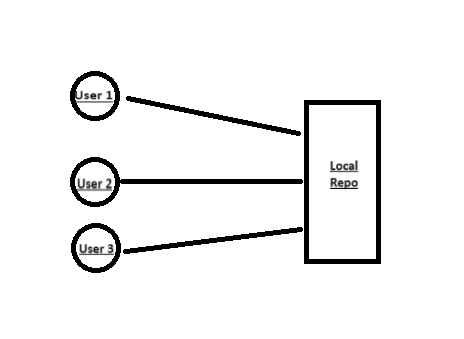
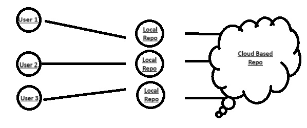

# Git Basics

## Version control
Put simply it is the practice of tracking and managing changes made to software. It allows us as developers to jump into 
a project and instantly get an understanding on where the project is going and where it has been without having to search
too many documents and files.

## Git and how it operates
Git is a popular Version Control System (VCS), it is distributed, so it is local to the user's hardware. Git is a program
that when downloaded and ran can be used to track and manage changes to files and directories.<br>
How Git operates is what makes it so popular. Git takes snapshots of a project or folder and saves the changed files whilst
linking the other files to their previous versions. If I was to have 3 files in Git after updating file A Git would track
the change to file A and then copy the data from the previous version of file B and C.<br>
Other VCSs just trak the changes made to the project.<br>

There are three stages in Git, Modify Staged and Commit.
### Modify
Projects are on the shelf, if you were to commit now nothing would be saved. These files have been modified but the change 
won't affect produce a new version
### Staged
These files have been changed and if committed Git would produce a new version. It's almost like putting a file into a shopping
cart, it hasn't been purchased, but it is not on the shelf anymore.
### Committed
A snapshot is taken of the folder profile, and it is saved into a repository.

## Basic workflow commands in git

- `git init`
This creates a git repository in the corresponding directory
- `git status`
This shows which files/ folders are staged (ready to be committed)
- `git add`
This adds a file/folder to the stage (ready to be committed)
- `git commit -m`
This commits the staged files/folders to the git repo
- `.gitignore`
This creates a folder that hides other folders from git status

## What can we use `git log` and `git diff` for?
- `git log`
Shows the commit history to the corresponding repository
- `git diff`
Helps me see, compare and understand changes between different commits

# Distributed Version Control

<ins>Diagram 1<ins><br>


 


<ins>Diagram 2<ins>



## Git vs GitHub
Diagram 1 shows the link between users and Git, a local repository. Diagram 2 shows the link between local repositories and
GitHub a cloud based repository. With a local repo everyone connected dumps their files into one repo which can lead to 
problems when people commit at the same time. The benefits of a cloud based repo or a distributed version control is that
users can simultaneously commit their files and projects without there being a problem because they are independently committed.

- GitHub<br>
GitHub is a could based distributed version control, it doesn't require every user link to a repo via hardware (locally).
Github does have a few competitors such as **Bitbucket** and **GitLab** and others.

## How to link Git and GitHub
GitHub gives clear commands to type into GitBash as listed below
```
git remote add origin https://github.com/temianibaba/tech258_git.git
git branch -M main
git push -u origin main
```